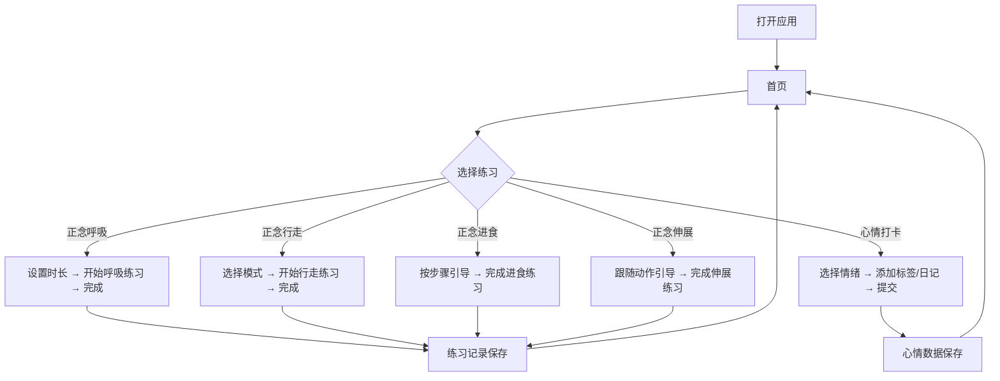

## 1. 产品概述

正念练习小程序是一款面向日常正念练习者的轻量级 Web 应用，集成了正念呼吸、正念行走、正念进食葡萄干、正念伸展及心情打卡五大核心模块，帮助用户在日常碎片时间中进行有引导的正念练习并记录情绪变化。

- **目标用户**：对正念冥想感兴趣的普通人，无需任何冥想基础
- **解决的问题**：提供随时随地可用的正念练习工具，降低正念入门门槛，培养日常正念习惯

## 2. 核心功能

### 2.1 用户角色

| 角色 | 说明 |
|------|------|
| 普通用户 | 无需注册，打开即用，练习记录和心情数据存储在浏览器本地 |

### 2.2 功能模块

1. **首页**：功能导航卡片、今日心情概览
2. **正念呼吸**：带呼吸动画引导的计时练习，可调节时长
3. **正念行走**：带步伐节奏引导的行走练习，支持室内/户外模式
4. **正念进食葡萄干**：分步骤引导的正念进食体验，包含观察、触摸、闻、品尝等阶段
5. **正念伸展**：带图示和文字引导的轻柔伸展练习
6. **心情打卡**：记录每日情绪状态，展示心情趋势图表

### 2.3 页面详情

| 页面名称 | 模块名称 | 功能描述 |
|----------|----------|----------|
| 首页 | 欢迎区域 | 显示日期、问候语、今日练习统计 |
| 首页 | 练习导航 | 5个练习模块的卡片入口，点击进入对应练习 |
| 首页 | 心情概览 | 最近7天心情走势简图 |
| 正念呼吸 | 时长选择 | 提供1/3/5/10分钟预设时长 |
| 正念呼吸 | 呼吸动画 | 圆形呼吸动画，随吸气/呼气节奏缩放 |
| 正念呼吸 | 计时器 | 倒计时显示，练习完成后提示音 |
| 正念呼吸 | 引导文字 | 阶段性提示文字（吸气、屏息、呼气） |
| 正念行走 | 模式选择 | 室内慢走 / 户外行走两种模式 |
| 正念行走 | 步伐引导 | 节奏性视觉或触觉引导 |
| 正念行走 | 行走计时 | 练习时长计时器 |
| 正念步行 | 引导提示 | 分阶段引导：专注脚步、感受地面、觉察身体 |
| 正念进食葡萄干 | 步骤引导 | 5步引导：观察→触摸→闻→品尝→回味 |
| 正念进食葡萄干 | 计时器 | 每一步的计时提醒 |
| 正念进食葡萄干 | 进度条 | 显示当前步骤和整体进度 |
| 正念伸展 | 动作引导 | 3-4个简单伸展动作，配文字说明 |
| 正念伸展 | 动作计时 | 每个动作保持时长计时 |
| 正念伸展 | 切换动画 | 动作之间的平滑切换 |
| 心情打卡 | 情绪选择 | 5种情绪等级（很好/好/一般/不太好/不好） |
| 心情打卡 | 标签选择 | 可选情绪标签（平静、焦虑、开心、疲惫等） |
| 心情打卡 | 心情日记 | 可选的文字记录输入 |
| 心情打卡 | 趋势展示 | 近7天/30天心情走势图表 |

## 3. 核心流程

## 4. 用户界面设计

### 4.1 设计风格

- **设计方向**：禅意自然 + 现代极简 — 融合东方禅宗美学与现代简洁设计
- **主色调**：
  - 背景：温暖的奶油米色 `#FBF7F0`，如宣纸质感
  - 主色：沉静的墨绿色 `#4A7C59`，象征自然与生命力
  - 辅助色：暖木棕 `#C8A882`，柔和土黄 `#E8D5B7`
  - 强调色：静谧蓝灰 `#7B9EA8` 用于呼吸模块
  - 文字色：深褐 `#3D3226`，柔和且易于阅读
- **字体**：
  - 标题：使用优雅衬线字体（如 Noto Serif SC）
  - 正文：使用清晰无衬线字体（如系统默认中文字体）
- **布局风格**：卡片式布局，大量留白，圆角柔和，层次分明
- **按钮风格**：柔和的圆角按钮，悬浮时微微上浮，按压时有下沉反馈
- **动效**：呼吸动画、页面切换淡入、卡片悬浮微动、圆形进度条平滑过渡
- **装饰元素**：淡雅的几何线条、水墨风格纹理背景、竹叶或石子等禅意小元素

### 4.2 页面设计概览

| 页面名称 | 模块名称 | UI元素 |
|----------|----------|--------|
| 首页 | 欢迎区域 | 居中大标题，日期展示，圆形今日练习统计环 |
| 首页 | 练习导航 | 5张圆角卡片纵向排列，每张包含图标、标题、简短描述，左侧彩色竖线标记 |
| 首页 | 心情概览 | 底部心情走势折线图，迷你尺寸 |
| 正念呼吸 | 时长选择 | 顶部横向 pill 按钮组，当前选中高亮 |
| 正念呼吸 | 呼吸动画 | 居中大型圆形，随呼吸节奏缩放，内部显示阶段文字，背景有扩散波纹 |
| 正念呼吸 | 控制区 | 开始/暂停/重置按钮，居中底部 |
| 正念行走 | 模式切换 | 顶部两段式切换开关 |
| 正念行走 | 引导区 | 居中大型图标+引导文字，带节奏脉冲动画 |
| 正念行走 | 计时器 | 圆形进度环 + 中央时间显示 |
| 正念进食 | 步骤展示 | 顶部5步骤进度条，当前步骤高亮 |
| 正念进食 | 引导卡片 | 居中卡片，显示当前步骤详细引导文字和图标，可滑动切换 |
| 正念进食 | 计时显示 | 卡片内显示当前步骤剩余时间 |
| 正念伸展 | 动作卡片 | 可滑动的动作卡片，包含人物插图占位、动作名称、保持时间、呼吸提示 |
| 正念伸展 | 进度 | 底部圆点指示器，显示当前动作位置 |
| 心情打卡 | 情绪选择 | 5个横向排列的面部表情图标按钮 |
| 心情打卡 | 标签 | 横向滚动的情绪标签 chips |
| 心情打卡 | 日记 | 文本输入区域，带字数计数 |
| 心情打卡 | 趋势图 | 下方迷你折线图，可切换7天/30天 |

### 4.3 响应式设计

- 桌面端优先设计，最大宽度 480px 居中显示（模拟手机体验）
- 移动端全宽自适应
- 触摸交互优化：按钮足够大（至少44px），滑动操作流畅

## 5. 非功能性需求

- 所有练习数据存储在浏览器 localStorage 中
- 无后端依赖，纯前端应用
- 支持离线使用
- 页面加载时间 < 2秒
- 动画帧率 ≥ 30fps
