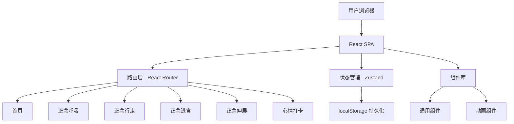

## 1. 架构设计



## 2. 技术描述

- **前端框架**：React 18 + TypeScript
- **样式方案**：Tailwind CSS 3
- **路由**：react-router-dom v6
- **状态管理**：zustand（练习记录、心情数据持久化到 localStorage）
- **图标**：lucide-react
- **初始化工具**：vite-init（react-ts 模板）
- **后端**：无，纯前端应用
- **数据存储**：localStorage

## 3. 路由定义

| 路由 | 页面组件 | 说明 |
|------|----------|------|
| `/` | HomePage | 首页，练习导航和心情概览 |
| `/breathing` | BreathingPage | 正念呼吸练习 |
| `/walking` | WalkingPage | 正念行走练习 |
| `/eating` | EatingPage | 正念进食葡萄干练习 |
| `/stretching` | StretchingPage | 正念伸展练习 |
| `/mood` | MoodPage | 心情打卡 |

## 4. 数据模型

### 4.1 练习记录

```typescript
interface PracticeRecord {
  id: string;
  type: 'breathing' | 'walking' | 'eating' | 'stretching';
  duration: number; // 秒
  completedAt: string; // ISO 日期字符串
}
```

### 4.2 心情记录

```typescript
interface MoodRecord {
  id: string;
  date: string; // YYYY-MM-DD
  level: 1 | 2 | 3 | 4 | 5; // 1=不好, 5=很好
  tags: string[];
  note: string;
  createdAt: string;
}
```

### 4.3 Zustand Store 结构

```typescript
interface AppStore {
  // 练习记录
  practiceRecords: PracticeRecord[];
  addPracticeRecord: (record: Omit<PracticeRecord, 'id'>) => void;
  
  // 心情记录
  moodRecords: MoodRecord[];
  addMoodRecord: (record: Omit<MoodRecord, 'id'>) => void;
  getTodayMood: () => MoodRecord | undefined;
  
  // 今日统计
  getTodayPracticeCount: () => number;
  getTodayPracticeMinutes: () => number;
}
```

## 5. 组件结构

```
src/
├── components/
│   ├── Layout.tsx              # 页面布局（顶部导航栏 + 内容区）
│   ├── BreathingCircle.tsx     # 呼吸动画圆形组件
│   ├── CircularProgress.tsx    # 圆形进度环组件
│   ├── MoodChart.tsx           # 心情走势迷你图表
│   ├── StepProgress.tsx        # 步骤进度条
│   ├── EmotionPicker.tsx       # 情绪选择器
│   ├── PracticeCard.tsx        # 练习入口卡片
│   └── TimerDisplay.tsx        # 计时器显示
├── pages/
│   ├── HomePage.tsx
│   ├── BreathingPage.tsx
│   ├── WalkingPage.tsx
│   ├── EatingPage.tsx
│   ├── StretchingPage.tsx
│   └── MoodPage.tsx
├── store/
│   └── useAppStore.ts          # Zustand store
├── utils/
│   └── storage.ts              # localStorage 工具函数
├── App.tsx
├── main.tsx
└── index.css
```

## 6. 关键交互设计

### 6.1 呼吸动画
- 使用 CSS `transform: scale()` 和 `transition` 实现缩放动画
- 动画周期：吸气4秒 → 屏息2秒 → 呼气6秒 → 屏息2秒
- 圆形从 scale(1) → scale(1.3) → scale(1.3) → scale(1)
- 配合颜色渐变和波纹扩散效果

### 6.2 心情图表
- 使用纯 SVG 绘制折线图，无需额外图表库
- 支持7天/30天切换

### 6.3 数据持久化
- 使用 zustand 的 `persist` 中间件，自动同步到 localStorage
- 练习记录保留最近90天
